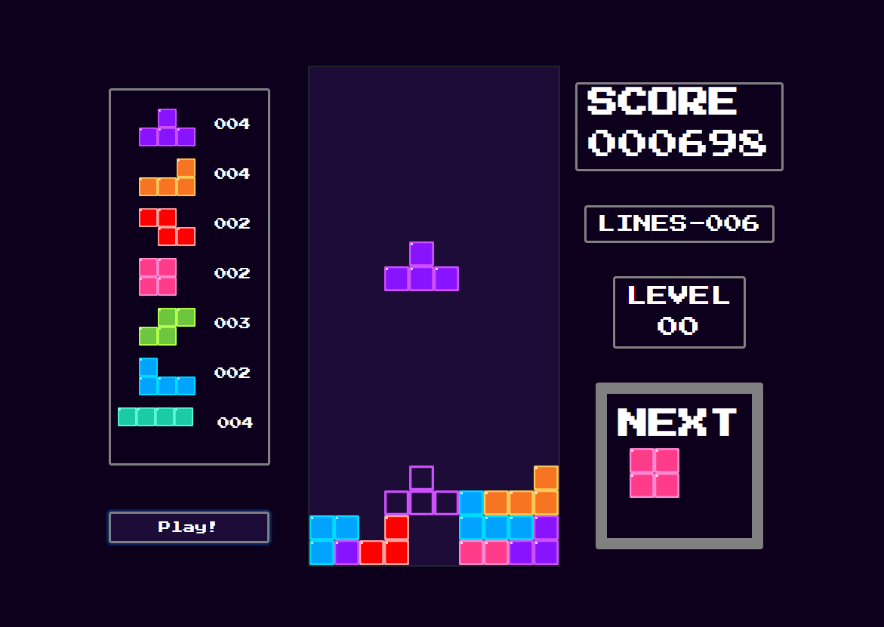

# eititan -- Tetris

Tetris application built in Angular. Tracks lines, level, score, next block up, and statistics about used blocks. This project also includes a hard-drop preview 
for falling block to give user an idea of where block sits.
Link to the game: [eititan's tetris](https://tetris-app-eititan.herokuapp.com/)



## Controls
The following controls are
* ESC: End's game
* Arrow Up: Rotates block
* Arrow Left: moves block left
* Arrow Right: moves block right
* Arrow Down: moves block down one row
* Space: Hard drop's block

## Future Features

* Class Tetris audio (ability to toggle)
* Gamepad support
* Mobile controls
* Top score for everyone to see
* Pause/Play
* WASD controls

## Blocks
All blocks are rendered in CanvasRenderingContext2D

## Run locally
To run locally, use ```ng serve``` or ```ng serve --open``` to run and open a tab in browser

## Big thanks to melcor76

Most of the game logic was forked from his repo
* GitHub: https://github.com/melcor76/ng-tetris
* Medium Article: https://medium.com/angular-in-depth/game-development-tetris-in-angular-64ef96ce56f7